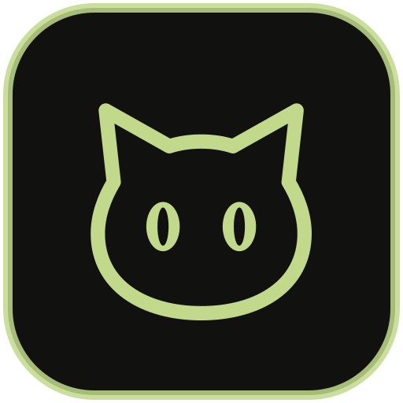

<p align="center"></p>

# Black Cat Reseller

A free, local-first Windows workspace for clothing resellers. Manage photos,
inventory, crosslisting, and sales on your own computer.

Created by **Nickolas Verdugo**. Open source under the [MIT License](LICENSE.txt).
Bug reports, ideas, documentation improvements, and code contributions are welcome.

**Status: Windows beta.** An installer with the MIT license will be published with
the next tester release. You can build and run the source now using the steps below.

## What it does

- Groups item photos by SKU and keeps the original photos.
- Provides a review workspace for titles, descriptions, pricing, and item details.
- Crosslists through your signed-in eBay, Depop, Poshmark, Mercari, and eligible
  Etsy accounts, with per-item progress and recovery for unresolved attempts.
- Tracks sales, shipping, returns, earnings, and backup status.
- Offers optional local image and clothing-label analysis; manual entry remains
  available without local AI.

Your inventory, photos, settings, and downloaded models stay on your PC. Marketplace
posting uses your own accounts. Review listings and follow each marketplace's rules.
Browser automation requires a connected second monitor and signed-in Chrome.

## Run from source

Use Windows 10 or 11 x64, Node.js 24, Git, and internet access for the initial setup.
Use a fresh checkout and a new local development database for these steps.

```powershell
git clone https://github.com/GasWhatWeSmoke/BlackCatReseller.git
Set-Location BlackCatReseller
npm.cmd ci
Copy-Item .env.example .env
New-Item -ItemType Directory -Force data | Out-Null
npm.cmd run prisma:generate
npx.cmd prisma db push
npm.cmd run db:init
npm.cmd run db:template
npm.cmd run worker:setup
npm.cmd run dev
```

The worker setup downloads portable Python and the photo-processing dependencies.
Local AI is optional; see [system requirements](SYSTEM_REQUIREMENTS.md) before
running `npm.cmd run vision:setup`. Its model and runtime downloads are kept out
of Git. Your `.env` file and local databases are also ignored.

For everyday workflow and installer setup, see [the setup guide](SETUP_FRIENDS.md).
The [ten-item practice guide](BETA-TEN-ITEMS.md) includes printable test SKU labels.

## Test and build

Close the app before building so its Prisma engine is available.

```powershell
npm.cmd test
npm.cmd run build:next
npm.cmd run release
```

The full test command runs JavaScript/TypeScript, PowerShell, and Python checks.
It requires the generated template database and worker runtime from the setup steps.
The release command creates a verified Windows installer and portable ZIP under
`dist/`, using an isolated build database. Include a matching changelog entry before
releasing a new version.

## Help improve Black Cat

[Report a bug or suggest a feature](https://github.com/GasWhatWeSmoke/BlackCatReseller/issues/new/choose).
If you want to change the code, read [CONTRIBUTING.md](CONTRIBUTING.md) and open a
pull request. Proposed changes are reviewed before entering the official version.

For security issues, use [private vulnerability reporting](SECURITY.md).

## License

Copyright (c) 2026 Nickolas Verdugo. This project's code is licensed under the
[MIT License](LICENSE.txt). Third-party components and downloaded models retain
their own licenses; see [Third-Party Software Notices](THIRD_PARTY_NOTICES.txt).
